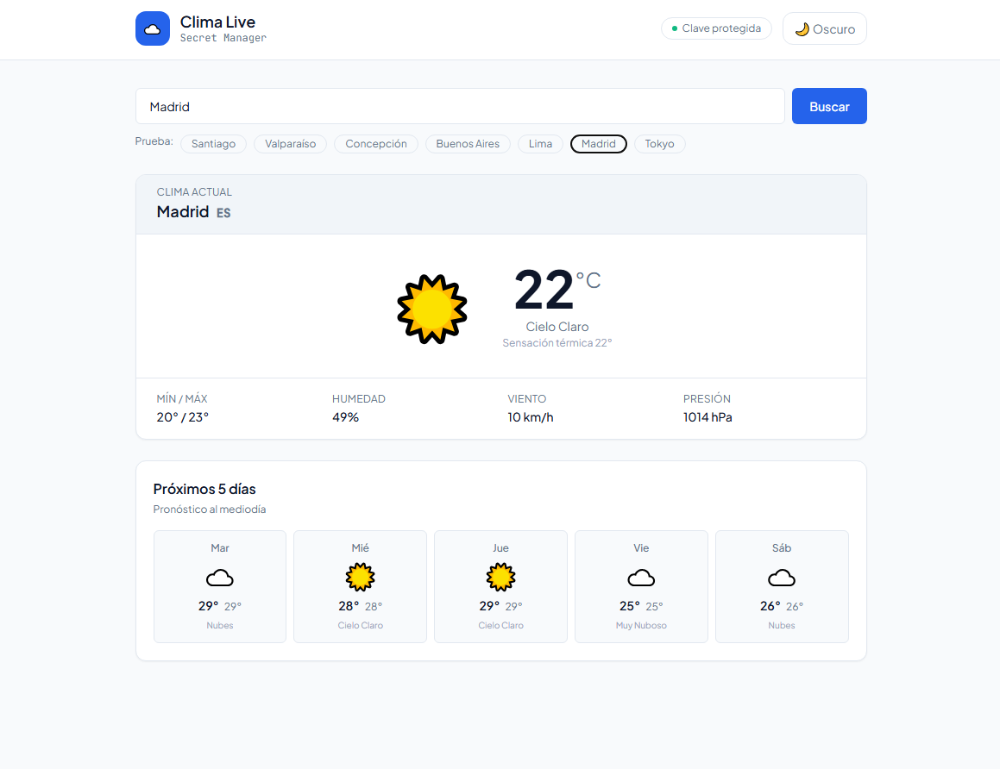
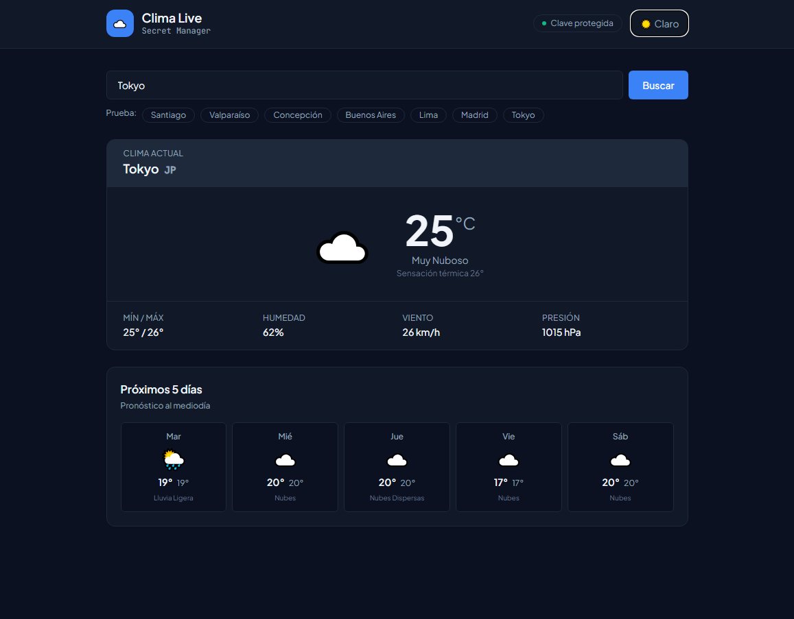
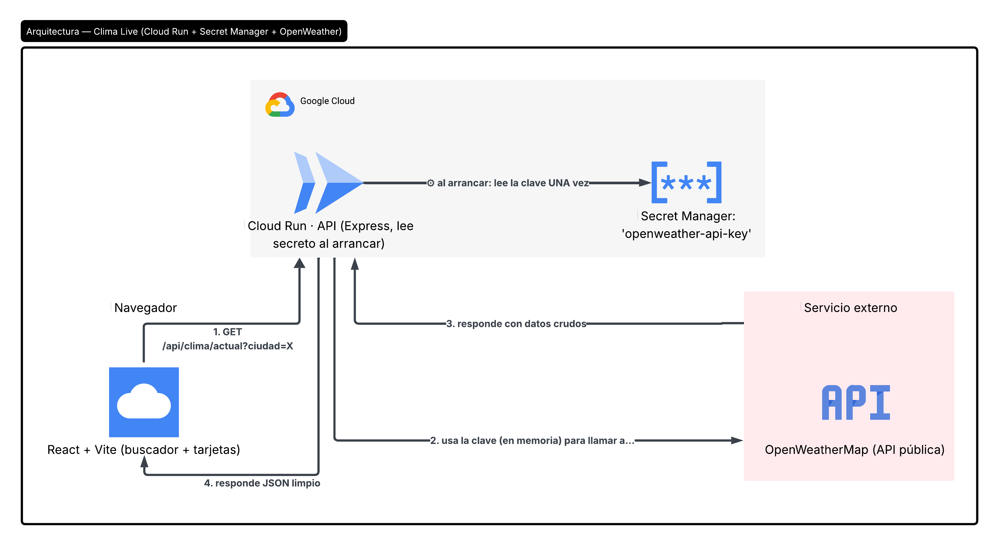
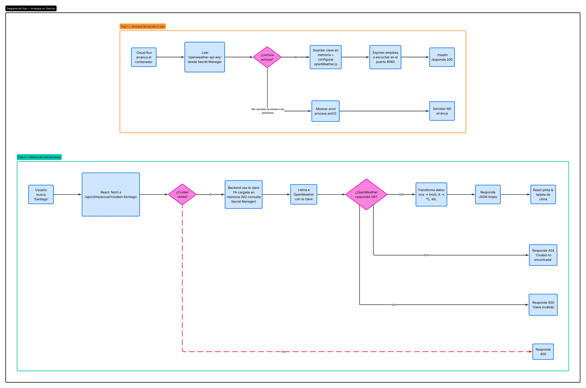
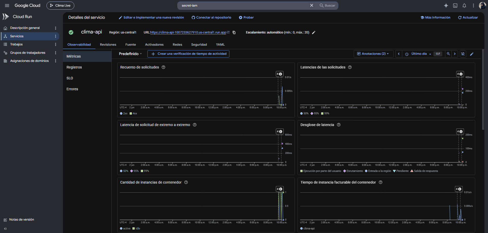
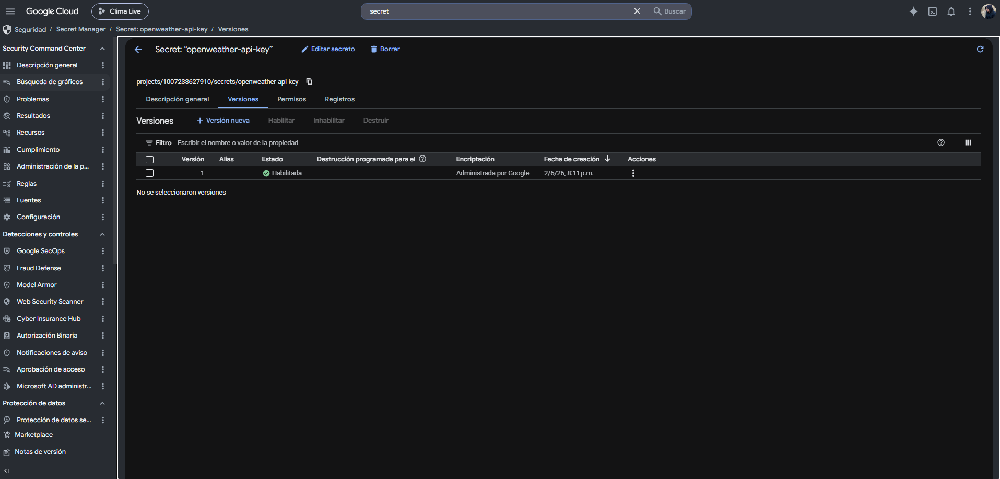
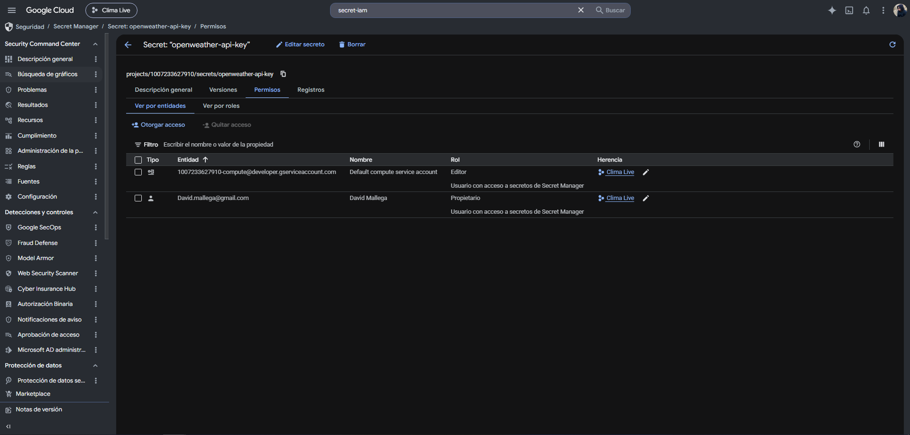
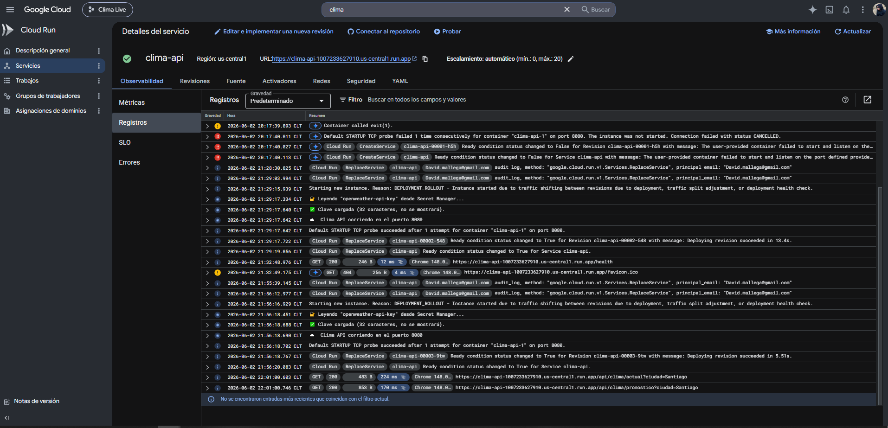
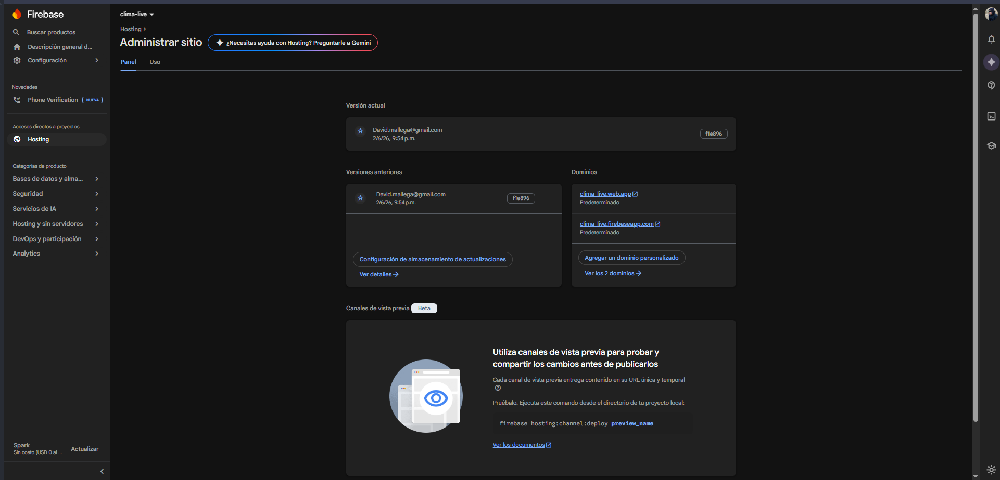

# Clima Live — Gestión de credenciales con Secret Manager

Aplicación fullstack desplegada en producción. Frontend React que consulta el clima en tiempo real a través de una API en Cloud Run. La clave de OpenWeatherMap vive en Google Secret Manager — nunca en el código, nunca en el frontend, nunca en GitHub.


---

## Vista previa

| Modo claro | Modo oscuro |
|-----------|-------------|
|  |  |

---

## ¿Qué hace?

Busca cualquier ciudad del mundo y muestra:
- **Clima actual** — temperatura, sensación térmica, humedad, viento y presión
- **Pronóstico de 5 días** al mediodía
- Sugerencias rápidas para Santiago, Valparaíso, Madrid, Tokyo, etc.

---

## Stack

| Capa | Tecnología |
|------|-----------|
| Frontend | React 18 · Vite · Tailwind CSS |
| Backend | Node.js 20 · Express |
| Gestión de secretos | Google Secret Manager |
| API externa | OpenWeatherMap |
| Cómputo | Google Cloud Run |
| Hosting frontend | Firebase Hosting |

---

## Arquitectura — la clave nunca toca al navegador

```
Cloud Run ──arranca──→ Secret Manager (lee la clave UNA VEZ)
                              │
                    [clave en memoria RAM]
                              │
React ──petición──→ Cloud Run ──con la clave──→ OpenWeather
                                                    ↓
React ←────── JSON limpio ─────── Cloud Run ←───── datos
```

Si abres DevTools → Network, solo verás llamadas a tu Cloud Run. La clave de OpenWeather nunca aparece en el bundle de JavaScript ni en las peticiones del navegador.





---

## Evidencia de despliegue

### Servicio activo en Cloud Run



### Secret Manager — secreto creado



### Permisos IAM del secreto



### Logs en producción — clave cargada al arrancar



### Métricas del servicio


### Firebase Hosting activo



---

## Estructura

```
06-clima/
├── backend/
│   ├── index.js                    Lee el secreto al arrancar, falla rápido si no existe
│   └── src/
│       ├── services/
│       │   ├── secretos.js         Cliente de Secret Manager con caché en memoria
│       │   └── openWeather.js      Cliente de la API externa
│       ├── controllers/
│       └── routes/
└── frontend/
    └── src/
        ├── components/             Buscador, ClimaActual, Pronostico
        ├── hooks/                  useClima, useTema
        └── App.jsx
```

---

## Correr en local

**Backend**
```bash
cd backend
npm install
gcloud auth application-default login
export GOOGLE_CLOUD_PROJECT=tu-proyecto-gcp
npm run dev   # http://localhost:8080
```

**Frontend**
```bash
cd frontend
npm install
npm run dev   # http://localhost:5173
```

---

## Endpoints de la API

| Método | Ruta | Acción |
|--------|------|--------|
| GET | `/api/clima/actual?ciudad=Santiago` | Clima actual |
| GET | `/api/clima/pronostico?ciudad=Santiago` | Pronóstico 5 días |
| GET | `/health` | Estado del servicio |

---

## Decisiones técnicas

- **Secret Manager vs variables de entorno de Cloud Run**: las env vars de Cloud Run son visibles para cualquier persona con acceso al panel. Secret Manager añade versionado, auditoría y control de acceso IAM granular.
- **Leer el secreto al arrancar, no en cada petición**: cada lectura de Secret Manager es una llamada HTTPS autenticada. Leerlo una vez y mantenerlo en memoria elimina esa latencia en cada request.
- **`process.exit(1)` si falla la carga**: mejor fallar inmediatamente con un error claro que arrancar sin credenciales y fallar de forma silenciosa en producción.
- **Por qué no `VITE_OPENWEATHER_KEY` en el frontend**: Vite mete todo lo que empieza con `VITE_` en el bundle público de JavaScript. Cualquier usuario puede leerla con clic derecho → Ver código fuente.
